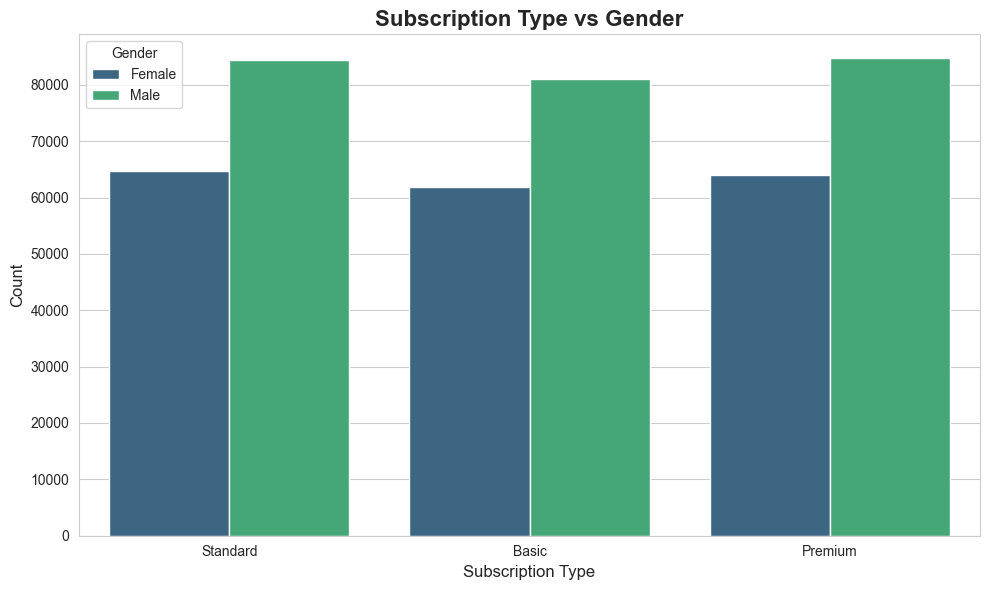
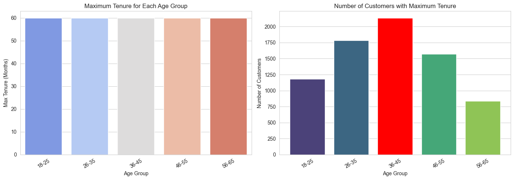
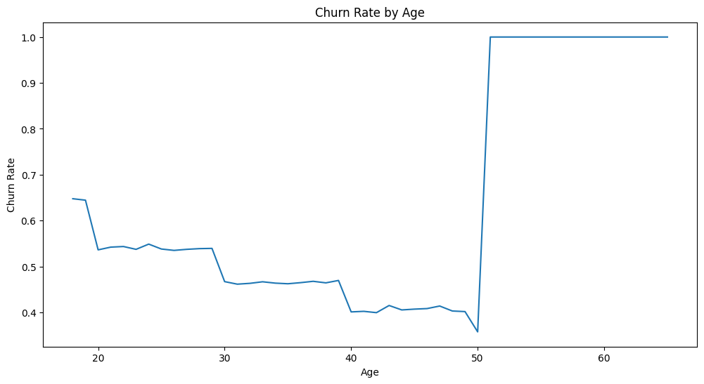
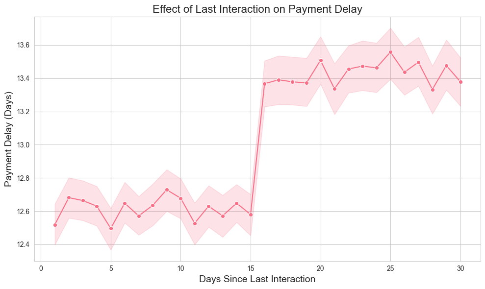
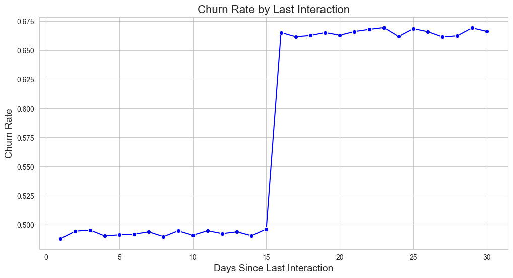
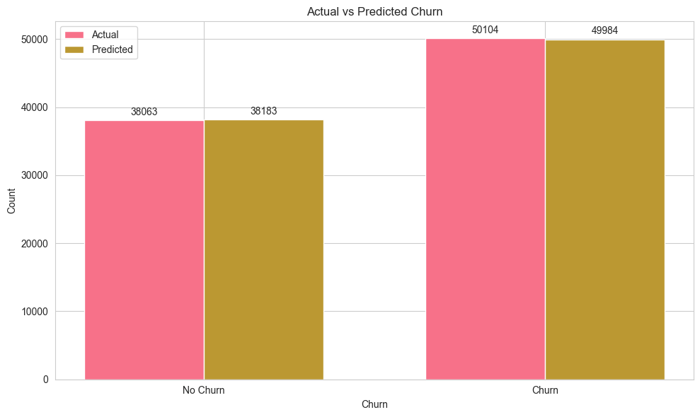
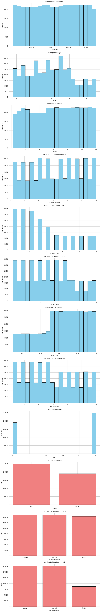
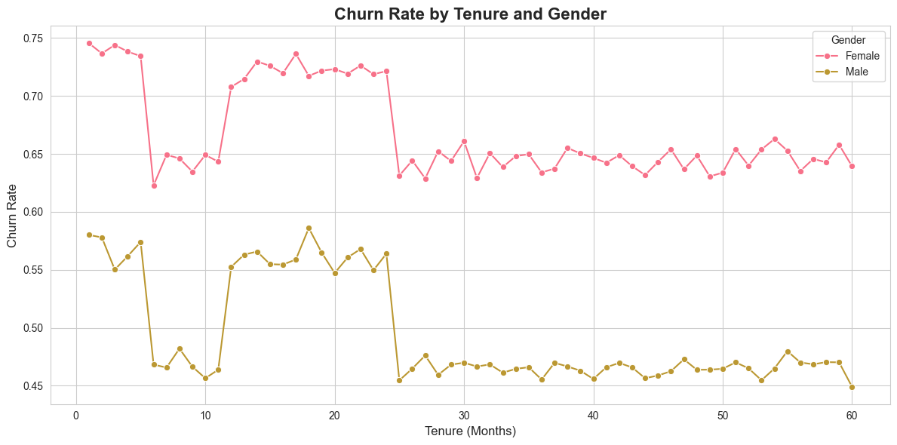
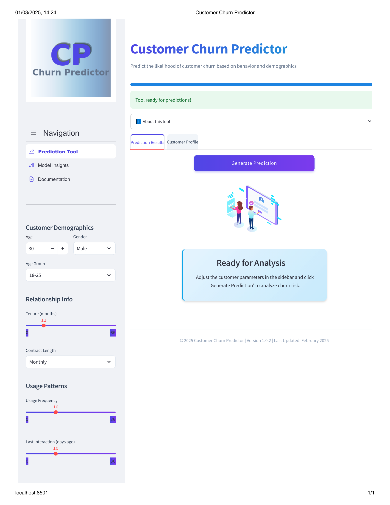
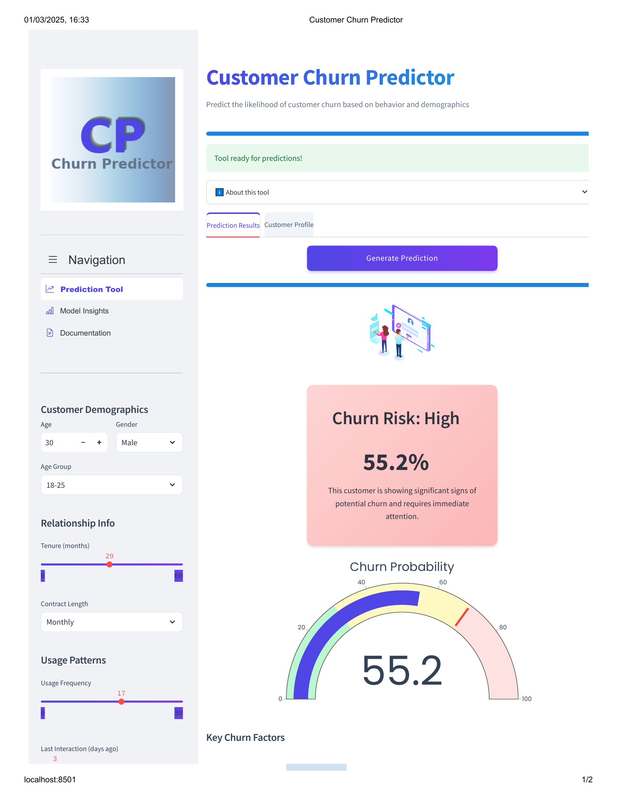

#
<div style="background-color:rgb(90, 92, 216); padding: 20px; border-radius: 10px; color: black; box-shadow: 0 4px 6px rgba(78, 78, 149, 0.1);">

#  **Customer Churn Prediction**

## Problem Statement
Customer churn is a critical challenge for subscription-based businesses. Identifying customers who are likely to discontinue their services is essential for implementing targeted retention strategies. This project focuses on developing a machine learning solution to predict customer churn in the telecommunications industry.

## Why This Matters
- **Revenue Protection**: Retaining existing customers is 5-25 times more cost-effective than acquiring new ones.
- **Resource Optimization**: Enables targeted interventions for at-risk customers.
- **Competitive Advantage**: Facilitates proactive improvements in customer experience.
- **Business Intelligence**: Provides actionable insights into the key factors driving customer dissatisfaction.

## Data Insights

### Demographic Patterns


### Age Group and Maximum Tenure Analysis


### Churn Rate Patterns


### Customer Interaction Impacts



### Model Performance


Our prediction model demonstrates:
- High accuracy in identifying both churning and non-churning customers.

### Feature Distribution Analysis


The feature distribution analysis reveals:
- Distinct patterns between churning and non-churning customers.
- Contract length shows a clear relationship with churn (shorter contracts have higher churn rates).
- Age, tenure, and payment method are strong predictors of customer behavior.
- Several features exhibit bimodal distributions, indicating potential customer segments with different churn probabilities.

### Gender and Tenure Relationship


## Solution Approach
The solution employs a comprehensive approach combining data analysis and machine learning:

1. **Data Exploration & Preprocessing**
   - Handled missing values and outliers.
   - Performed feature engineering to extract meaningful insights.
   - Applied encoding techniques for categorical variables.

2. **Model Development**
   - Implemented a classification algorithm (Random Forest).
   - Conducted hyperparameter tuning using grid search.
   - Addressed class imbalance using appropriate sampling techniques.

3. **Evaluation Framework**
   - Utilized metrics beyond accuracy (F1-score, ROC-AUC, precision-recall).
   - Applied k-fold cross-validation for robust performance assessment.

4. **Deployment Solution**



- Developed an **advanced interactive web application** for real-time churn prediction.
- The tool features:
  - A user-friendly interface for inputting customer parameters.
  - Clear visualization of churn probability.
  - Risk categorization (High/Medium/Low).
  - Detailed explanation of contributing factors.
  - Customizable analysis for different customer segments.

## Results & Impact
The final model achieved:
- **High accuracy**: 
- 99.6% (F1-score) and 99.2 accuracy

Key findings:
- Contract type, tenure, and monthly charges were the most significant predictors.
- Customers with month-to-month contracts showed 3x higher churn rates.
- Technical support utilization strongly correlated with customer retention.
- The critical 15-day customer interaction threshold provides a clear intervention window.
- Gender-based differences in churn behavior require targeted retention approaches.

## Technologies Used
- **Python**: Primary programming language.
- **Pandas/NumPy**: Data manipulation.
- **Scikit-learn**: Model implementation.
- **Matplotlib/Seaborn**: Visualization.
- **RandomForest**: RandomForest implementation.
- **Streamlit/HTML/CSS**: Web application development and front-end interface.

---

# **Deployment on AWS EC2**

This project involves deploying the Streamlit-based Churn Predictor web application on an AWS EC2 instance. Below are the detailed steps I followed to achieve this deployment:

### Steps to Deploy the Churn Predictor Web App on AWS EC2:

1. **Launch an EC2 Instance:**
   - Navigate to the AWS EC2 dashboard and launch a new instance.
   - Name the instance (e.g., `churn_predictor`).
   - Select the appropriate application OS (Amazon Machine Image).
   - Choose the instance type (I used `t2.micro` as it is eligible for the free tier).
   - Generate and securely save the key pair for SSH access.

2. **Configure Network Settings:**
   - Ensure that all necessary network settings are configured to allow access.
   - Set the security group to allow inbound traffic on port 8501 (used by Streamlit).

3. **Launch the Instance:**
   - Launch the EC2 instance after completing the setup.

4. **Connect to the Instance:**
   - Copy the SSH client command provided by AWS for your instance.
   - Open PowerShell or VS Code terminal and paste the SSH command to connect to the instance.

5. **Set Up a Python Virtual Environment:**
   - Create a new Python virtual environment using the following command:
     ```bash
     python3 -m venv myenv
     ```
   - Activate the virtual environment:
     ```bash
     source myenv/bin/activate
     ```

6. **Transfer Application Files:**
   - Transfer the necessary application files (`requirements.txt` and `app.py`) to the EC2 instance using SCP or any file transfer tool.

7. **Install Dependencies:**
   - Install the required Python packages by running:
     ```bash
     pip install -r requirements.txt
     ```

8. **Run the Streamlit Application:**
   - Start the Streamlit app by running:
     ```bash
     streamlit run app.py
     ```
   - Ensure the app is running on port 8501.

9. **Configure Security Group for Port 8501:**
   - Add an inbound rule to the EC2 instance's security group to allow traffic on port 8501. This ensures the web app is accessible.

---

### Notes:
- Replace `app.py` with the actual filename of your Streamlit application if it differs.
- Ensure the key pair is securely stored and not shared publicly.
- For persistent deployment, consider using a process manager like `systemd` or `supervisord` to keep the app running after the SSH session ends.

</div>